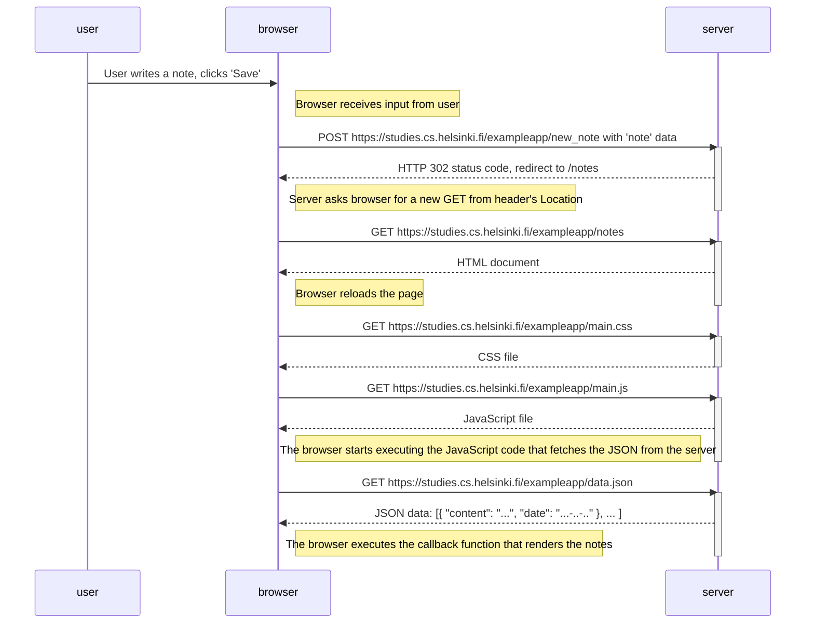

```mermaid

sequenceDiagram
  participant user
  participant browser
  participant server

  user->>browser: User writes a note, clicks 'Save'
  Note right of browser: Browser receives input from user

  browser->>server: POST https://studies.cs.helsinki.fi/exampleapp/new_note with 'note' data

  activate server
  server-->>browser: HTTP 302 status code, redirect to /notes
  Note right of browser: Server asks browser for a new GET from header's Location
  deactivate server

  browser->>server: GET https://studies.cs.helsinki.fi/exampleapp/notes
  activate server
  server-->>browser: HTML document
  Note right of browser: Browser reloads the page
  deactivate server

  browser->>server: GET https://studies.cs.helsinki.fi/exampleapp/main.css
  activate server
  server-->>browser: CSS file
  deactivate server

  browser->>server: GET https://studies.cs.helsinki.fi/exampleapp/main.js
  activate server
  server-->>browser: JavaScript file
  Note right of browser: The browser starts executing the JavaScript code that fetches the JSON from the server
  deactivate server

  browser->>server: GET https://studies.cs.helsinki.fi/exampleapp/data.json
  activate server
  server-->>browser: JSON data: [{ "content": "...", "date": "...-..-.." }, ... ]
  Note right of browser: The browser executes the callback function that renders the notes
  deactivate server
```
