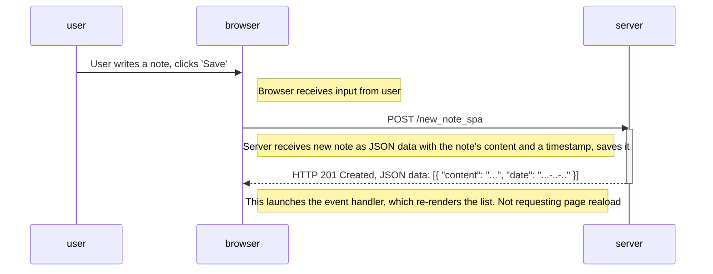

```mermaid

sequenceDiagram

  participant user
  participant browser
  participant server

  user->>browser: User writes a note, clicks 'Save'
  Note right of browser: Browser receives input from user

  browser->>server: POST /new_note_spa
  activate server

  Note left of server: Server receives new note as JSON data with the note's content and a timestamp, saves it

  server-->>browser: HTTP 201 Created, JSON data: [{ "content": "...", "date": "...-..-.." }]
  deactivate server
  Note right of browser: This launches the event handler, which re-renders the list. Not requesting page reaload
```
